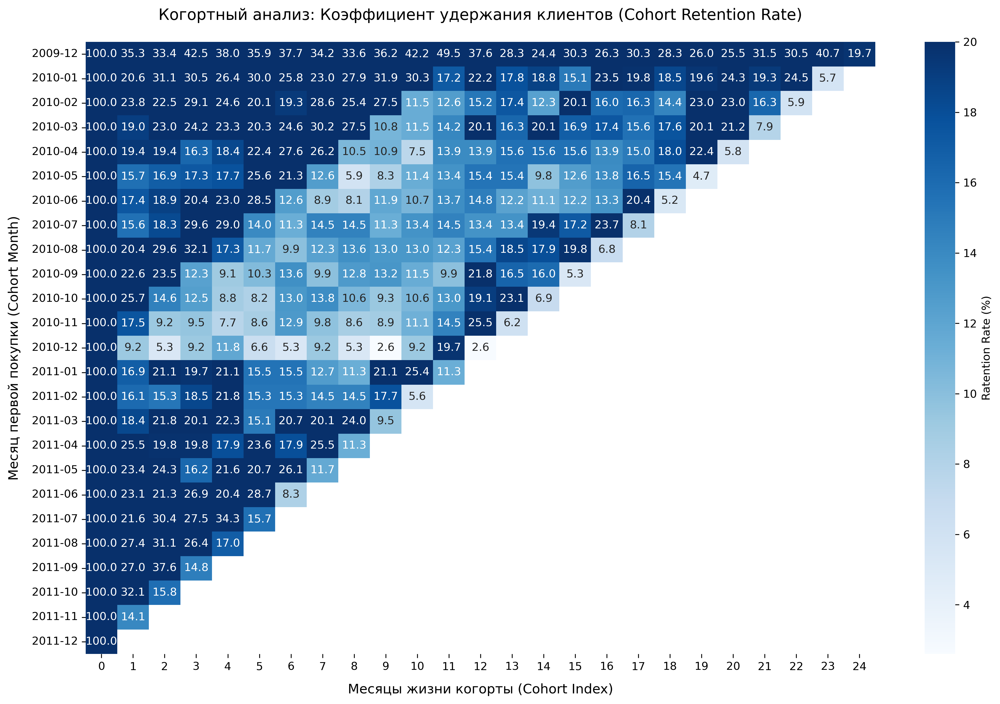

# 📊 Когортный анализ интернет-магазина подарков (Online Retail II)

### 📌 Описание проекта
Исследование удержания клиентов (**Cohort Retention Rate**) на основе исторических транзакций британского онлайн-ритейлера. 

**Цель проекта**: Разбить пользователей на когорты по месяцу первой покупки, оценить их возвращаемость в динамике, найти аномалии на тепловой карте и предложить решения для CRM-маркетинга.

### 🛠 Стек технологий
* **Python (Pandas)** — очистка данных от мусора и расчет матрицы удержания.
* **Seaborn & Matplotlib** — построение и кастомизация тепловой карты (Heatmap).

---

### 📉 Основные этапы и результаты

#### 1. Тотальная предобработка данных
Сырые данные содержали много технических ошибок и аномалий, которые искажали метрики. В ходе очистки было сделано:
* Удалены строки без `Customer ID` (без них невозможно отследить пользователя).
* Избавились от 26 тысяч полных технических дубликатов строк, раздувавших продажи.
* Текстовый столбец даты переведен в формат `datetime64`.
* Отсечены возвраты (инвойсы на букву 'C'), а также нулевые/отрицательные цены и количества.
* Итоговый чистый массив для анализа составил **805 549 строк**.

#### 2. Расчет и визуализация матрицы Retention
* Пользователи сгруппированы по месяцу "рождения" (первой покупки).
* Для каждого повторного заказа рассчитан индекс месяца жизни (`CohortIndex`).
* Абсолютные значения переведены в проценты и округлены для удобства чтения бизнеса.
* Отрисована кастомизированная тепловая карта в Seaborn.

---

### 🔍 Главный инсайт исследования: "Эффект периода" в декабре 2010

При анализе тепловой карты замечена сквозная аномалия: в декабре 2010 года почти все существующие когорты резко "побледнели" и плохо возвращались следующие 9 месяцев. 

Выяснив исторический контекст, была найдена причина: в декабре 2010 года в Великобритании случились рекордные снегопады за 100 лет. Страну парализовало, что привело к логистическому коллапсу интернет-магазина перед Новым годом.

* **Люди ушли из-за негатива**: Клиенты, столкнувшиеся с задержками и отменами заказов в праздники, запомнили этот опыт и перестали возвращаться.
* **Старички простили**: Наша самая лояльная "золотая" когорта (декабрь 2009) пострадала меньше всех. У этих клиентов уже был годовой успешный опыт работы с нами, и они списали проблему на форс-мажор.
* **Новички стабильны**: Когорты середины 2011 года вообще не застали этот кошмар. Для них сервис работал нормально, поэтому их показатели удержания снова пошли вверх ("потемнели").

---

### 🛠 Рекомендация для бизнеса:
Пользователям, которые застали тот кризис зимы 2010 года и "уснули", нужно отправить честное, человеческое письмо от CRM-маркетинга: 
> *«Мы помним, что подвели вас с подарками из-за снегопадов. Просим увас прощения. За этот год мы полностью перестроили логистику, и теперь всё работает отлично. Вот вам персональный промокод на скидку, просто попробуйте заказать у нас ещё раз, мы не подведем»*.

